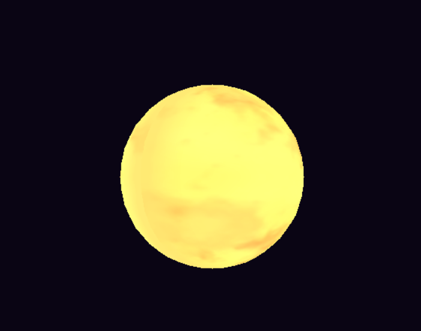
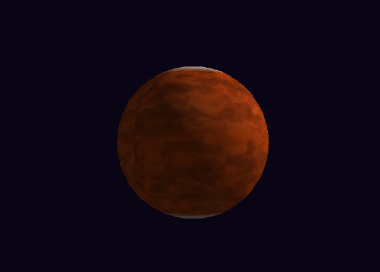
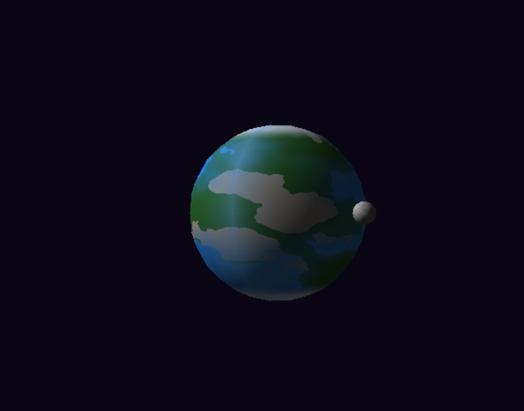
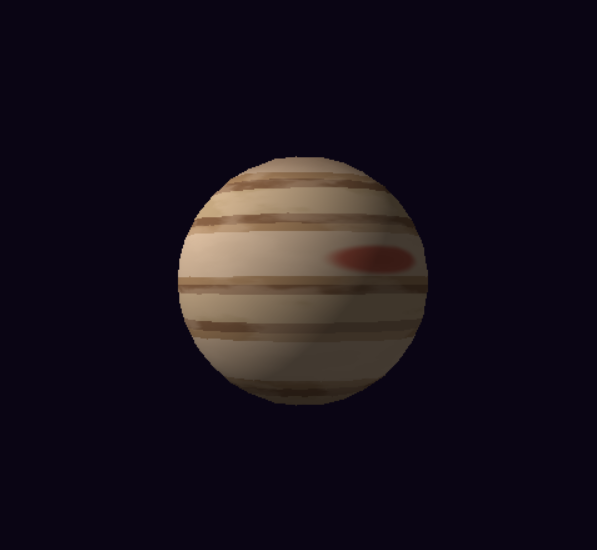
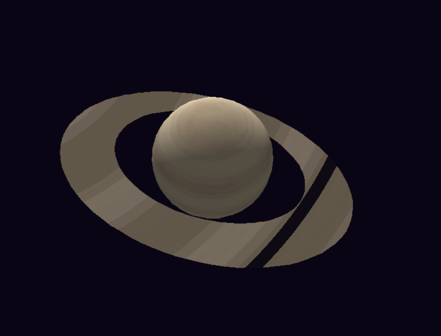
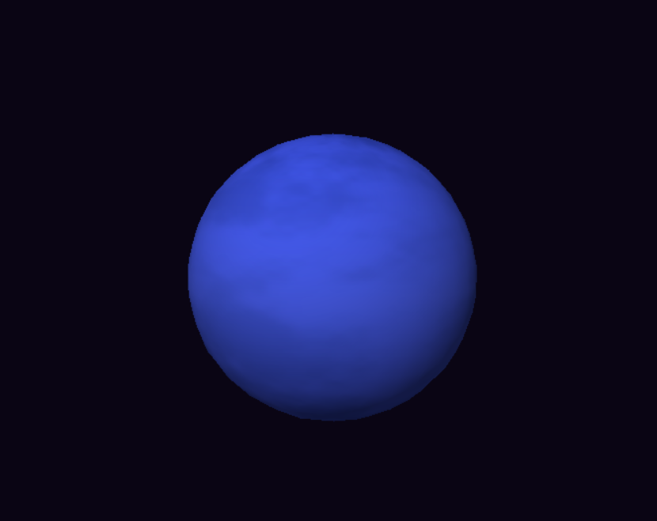

# 🌌 Sistema Solar - Software Renderer con Shaders Procedurales

Laboratorio de Gráficas por Computadora que implementa un **renderizador 3D por software** capaz de generar 6 cuerpos celestes únicos usando exclusivamente **shaders procedurales** (sin texturas ni materiales externos).

## ✨ Características Principales

### 🪐 **6 Cuerpos Celestes Implementados**
- ☀️ **Sol** (Estrella) - 5 capas: base brillante, manchas solares, granulación, erupciones animadas, corona
- 🔴 **Marte** (Planeta Rocoso) - 4 capas: superficie oxidada, cráteres realistas, casquetes polares, variación de terreno
- 🌍 **Tierra** (Planeta Rocoso) - 5 capas: océanos profundos, continentes, hielo polar, nubes animadas, atmósfera
- 🟠 **Júpiter** (Gigante Gaseoso) - 4 capas: bandas horizontales, turbulencia, Gran Mancha Roja, oscurecimiento polar
- 🪐 **Saturno** (Gigante Gaseoso) - 4 capas: color crema, bandas sutiles, turbulencia atmosférica, hexágono polar
- 🔵 **Neptuno** (Gigante de Hielo) - 4 capas: azul intenso, tormentas, variación latitudinal, iluminación
- 🌙 **Luna orbitando la Tierra** - Shader independiente con cráteres y mares lunares
- 💍 **Anillos de Saturno** - Sistema de anillos con bandas concéntricas y División de Cassini
- 🎬 **Animaciones procedurales** - Nubes terrestres, erupciones solares, turbulencia atmosférica
- 📷 **Cámara orbital interactiva** - Control completo de navegación 3D

## 🎨 Técnicas de Rendering

### Pipeline Gráfico Completo
```
Vertex Shader → Rasterización → Fragment Shader → Z-Buffer → Framebuffer
```

### Shaders Procedurales (Sin Texturas)
- **Fractal Brownian Motion (FBM)** - Generación de noise multi-octava
- **Coordenadas baricéntricas** - Interpolación suave de atributos
- **Efecto Fresnel** - Atmósferas y coronas en bordes planetarios
- **Smoothstep** - Transiciones suaves entre capas
- **UV Mapping esférico** - Proyección de patrones en esferas
- **Bandas procedurales** - Patrones horizontales para gigantes gaseosos


## 🎮 Controles
```
[1-6]     Cambiar entre planetas
WASD/↑↓←→ Orbitar cámara
Q/E       Zoom in/out
R         Resetear cámara
ESC       Salir
```

## 🛠️ Tecnologías

- **Lenguaje:** Rust 1.70+
- **Matemáticas 3D:** nalgebra-glm
- **Window Management:** minifb
- **Arquitectura:** Pipeline gráfico moderno con shaders programables

## 📸 Galería

### ☀️ Sol (Estrella)

*Estrella con 5 capas: manchas solares, granulación, erupciones animadas y corona brillante*

### 🔴 Marte (Planeta Rocoso)

*Planeta rocoso con cráteres realistas, casquetes polares y variación de terreno*

### 🌍 Tierra (Planeta Rocoso + Luna)

*Océanos profundos, continentes verdes, nubes animadas y luna orbitando*

### 🟠 Júpiter (Gigante Gaseoso)

*Bandas horizontales, turbulencia atmosférica y Gran Mancha Roja*

### 🪐 Saturno (Gigante Gaseoso + Anillos)

*Atmósfera serena con sistema de anillos y División de Cassini*

### 🔵 Neptuno (Gigante de Hielo)

*Azul intenso con tormentas y variación latitudinal*
 

## 🚀 Instalación
```bash
git clone https://github.com/Emadlgg/lab5_graficas.git
cd lab5_graficas
cargo build --release
cargo run --release
```

## 💡 Aspectos Destacados

- ✅ **100% procedural** - Ninguna textura externa utilizada
- ✅ **Renderizado por software** - Todo calculado en CPU
- ✅ **Shaders complejos** - Hasta 5 capas de efectos superpuestos
- ✅ **Físicamente inspirado** - Basado en características reales de planetas
- ✅ **Optimizado** - Z-buffer, bounding box, pre-allocation
- ✅ **Extensible** - Sistema modular de shaders fácil de expandir

## 👨‍💻 Autor

Emadlgg
Gráficas por Computadora - Universidad del Valle de Guatemala  
Noviembre 2025

---
